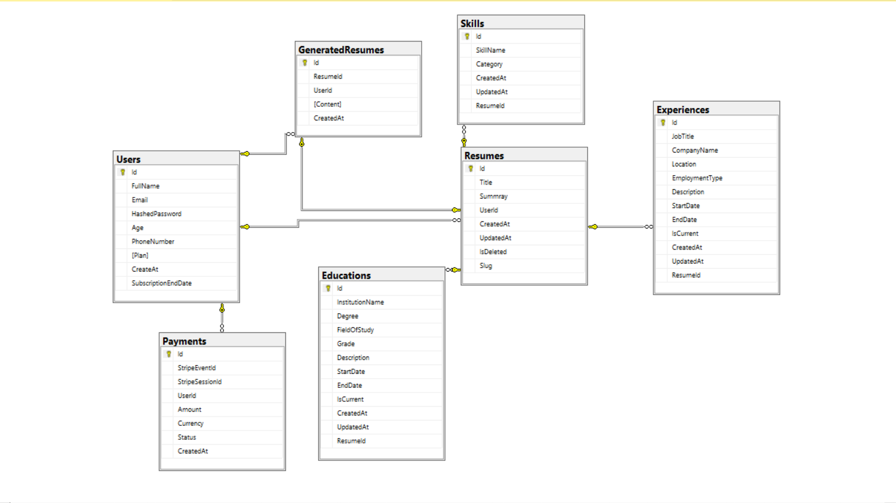
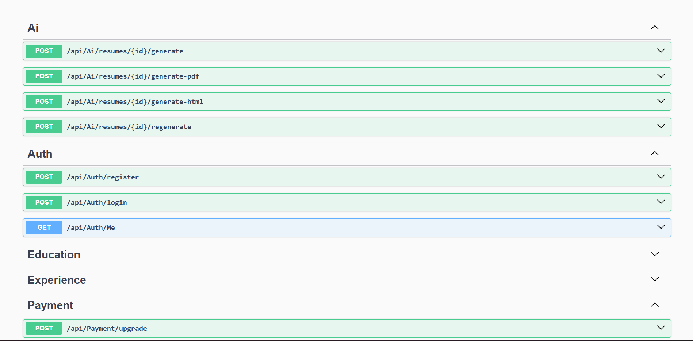
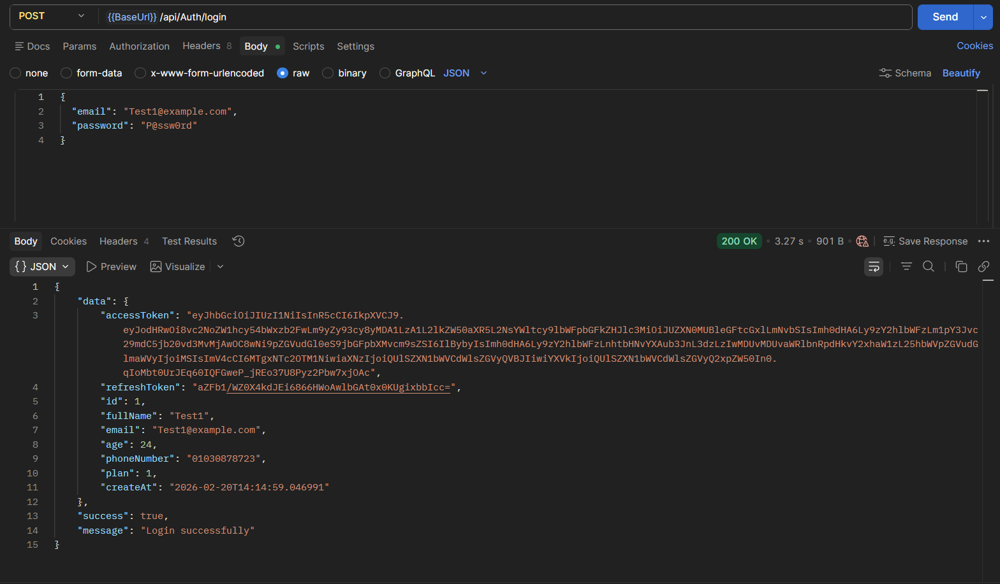
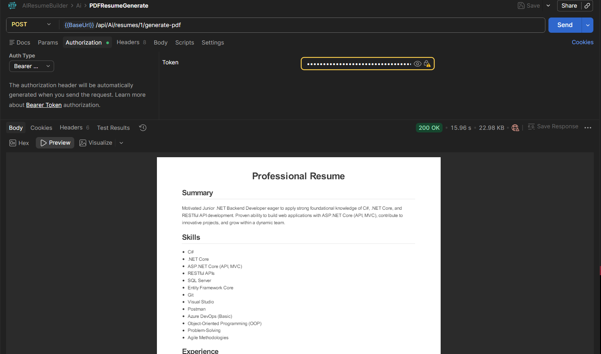

# 🚀 AI Resume Builder SaaS

AI Resume Builder is a production-ready SaaS platform that helps users build, optimize, and export professional resumes using AI.

Built with `ASP.NET Core Web API` and `Clean Architecture`, the platform supports secure authentication, resume content management, AI-powered generation, PDF/HTML export, plan-based feature gating, and payment-based upgrades.

---

## ✨ Features

### Authentication & User Management
- Secure registration and login with JWT-based authentication
- Protected endpoints using `[Authorize]`
- User profile identity propagated via JWT claims

### Resume Management
- Create, update, delete, and retrieve resumes
- Public resume sharing via slug-based endpoint
- Modular management of:
  - Education
  - Experience
  - Skills

### AI Resume Generation
- AI-generated full resume content from stored profile/resume data
- Regeneration support for improved iterations
- Persisted generation history for usage tracking

### Export & Delivery
- HTML resume rendering for browser preview
- PDF generation for downloadable resumes
- Plan-aware export capabilities

### SaaS & Monetization
- Free vs Pro feature gating
- Monthly generation quotas by plan
- Stripe checkout integration for Pro upgrades
- Webhook processing with idempotency protection

---

## 🧰 Tech Stack

- **Backend:** `ASP.NET Core 8 Web API`
- **Architecture:** Clean Architecture + Vertical Slice feature organization
- **ORM:** `Entity Framework Core`
- **Database:** `SQL Server`
- **Authentication:** `JWT Bearer Tokens`
- **AI Integration:** External LLM API (Gemini-compatible endpoint)
- **Payments:** `Stripe Checkout + Webhooks`
- **Document Export:** HTML rendering + PDF generation
- **API Docs:** Swagger / OpenAPI

---

## 🏗️ Architecture Overview

This solution combines:

1. **3-Tier separation**
   - `API` (presentation / transport)
   - `Application` (business use cases)
   - `Infrastructure` (external concerns: DB, payment, AI, PDF)
   - `Domain` (core entities and enums)

2. **Vertical Slice mindset**
   - Features are implemented end-to-end per business capability (Auth, Resume, AI, Payment, Usage)
   - Each slice contains DTOs, services, and persistence logic relevant to that feature

This structure keeps the codebase modular, testable, and scalable for SaaS growth.

---

## 📁 Project Structure

```text
AIResumeBuilder.API/              # Controllers, DTO contracts, Program bootstrap
AIResumeBuilder.Application/      # Use-cases, service interfaces/implementations, DTOs, mapping
AIResumeBuilder.Domain/           # Entities, enums, core business model
AIResumeBuilder.Infrastructure/   # EF Core DbContext, repositories, migrations, external services
```

Key API controllers:
- `AuthController`
- `ResumeController`
- `EducationController`
- `ExperienceController`
- `SkillController`
- `AiController`
- `PaymentController`
- `UsageController`

---

## 🚀 Getting Started

### Prerequisites
- `.NET SDK 8.0+`
- `SQL Server` (local or remote)
- Stripe account (optional for real payment flow)
- AI provider key (for real AI generation)

### 1) Clone repository
```bash
git clone https://github.com/KamalElsayedJR/AIResumeBuilderSaaS.git
cd AIResumeBuilderSaaS
```

### 2) Restore dependencies
```bash
dotnet restore
```

### 3) Configure settings
Update configuration in `AIResumeBuilder.API/appsettings.json` or use environment variables (recommended in production).

### 4) Apply database migrations
Package Manager Console:
```powershell
update-database
```

.NET CLI alternative:
```bash
dotnet ef database update --project AIResumeBuilder.Infrastructure --startup-project AIResumeBuilder.API
```

### 5) Run the API
```bash
dotnet run --project AIResumeBuilder.API
```

### 6) Open Swagger
Navigate to the Swagger URL shown at startup (typically `https://localhost:<port>/swagger`).

---

## 🔐 Environment Variables

Use environment variables for secrets in production:

- `ConnectionStrings__DefaultConnection`
- `JWT__SecretKey`
- `JWT__Issuer`
- `JWT__Audience`
- `JWT__ExpirationInMinutes`
- `AIAPI__APIKey`
- `AIAPI__EndPoint`
- `Stripe__SecretKey`
- `Stripe__WebhookSecret`

> Never commit real secrets to source control.

---

## 📌 API Endpoints Overview

### Auth
- `POST /api/Auth/register`
- `POST /api/Auth/login`
- `GET /api/Auth/Me` (Authorized)

### Resume
- `POST /api/Resume` (Authorized)
- `GET /api/Resume` (Authorized)
- `GET /api/Resume/{resumeId}` (Authorized)
- `PUT /api/Resume/{resumeId}` (Authorized)
- `DELETE /api/Resume/{resumeId}` (Authorized)
- `GET /api/Resume/public/{slug}` (Public)

### Education
- `POST /api/Resume/{resumeId}/Education`
- `PUT /api/Resume/{resumeId}/Education/{educationId}`
- `DELETE /api/Resume/{resumeId}/Education/{educationId}`

### Experience
- `POST /api/Resume/{resumeId}/experience`
- `PUT /api/Resume/{resumeId}/experience/{experienceId}`
- `DELETE /api/Resume/{resumeId}/experience/{experienceId}`

### Skill
- `POST /api/Resume/{resumeId}/skill`
- `PUT /api/Resume/{resumeId}/skill/{skillId}`
- `DELETE /api/Resume/{resumeId}/skill/{skillId}`

### AI Generation & Export
- `POST /api/Ai/resumes/{id}/generate`
- `POST /api/Ai/resumes/{id}/regenerate`
- `POST /api/Ai/resumes/{id}/generate-html`
- `POST /api/Ai/resumes/{id}/generate-pdf`

### Usage & Billing
- `GET /api/Usage/getusage`
- `POST /api/Payment/upgrade`
- `POST /api/Payment/webhook` (Stripe callback)

---

## 🔑 Authentication Flow (JWT)

1. User registers using `/api/Auth/register`.
2. User logs in via `/api/Auth/login`.
3. API returns a signed JWT token.
4. Client sends token in header:
   - `Authorization: Bearer <token>`
5. Protected endpoints validate token issuer, audience, signature, and expiry.

---

## 🗄️ Database Design Overview

Core entities:
- `User`
- `Resume`
- `Education`
- `Experience`
- `Skill`
- `GeneratedResumes`
- `Payment`

High-level relationships:
- One `User` → many `Resume`
- One `Resume` → many `Education`, `Experience`, `Skill`
- Generated content tracked per `Resume` and `User`
- Payments linked to `User` and Stripe metadata (event/session IDs)

Additional design notes:
- Soft-delete behavior exists on `Resume` (`IsDeleted`)
- Public sharing supported through `Resume.Slug`

---

## 🧩 Feature Gating (Free vs Pro)

Current gating model:
- **Free Plan**
  - Lower monthly AI generation quota
  - PDF export restricted
- **Pro Plan**
  - Higher monthly generation quota
  - PDF export enabled

Usage is enforced server-side (not only in UI), which makes plan restrictions reliable and secure.

---

## 🤖 AI Integration

Resume generation flow (conceptual):
1. User creates and fills resume sections.
2. Backend assembles normalized data payload.
3. `IAIService` sends prompt/context to configured AI endpoint.
4. AI response is validated and mapped to `AiResponse`.
5. Generated output is stored for history and quota tracking.
6. Output can be returned as JSON, rendered HTML, or exported PDF.

---

## 💳 Payment Integration

The billing flow uses Stripe Checkout:
- `POST /api/Payment/upgrade` creates a checkout session
- User completes payment on Stripe-hosted page
- Stripe sends `checkout.session.completed` webhook
- Webhook updates user plan to `Pro` and stores payment record
- Event idempotency is enforced via `StripeEventId` checks

---
## 📸 Screenshots

### 🗄️ Database Design


### 📘 API Documentation (Swagger)


### 🔐 Authentication Flow (Login)


### 📄 AI Resume PDF Generation

---
## 🛣️ Future Improvements / Roadmap

- Frontend dashboard (React/Next.js) with resume templates
- Team/workspace accounts for recruiters and agencies
- Multi-currency subscriptions and billing portal
- AI prompt versioning and A/B quality scoring
- Resume ATS scoring and keyword optimization insights
- Background job processing for heavy AI/export workflows
- Automated integration and load testing pipeline

---

## 🤝 Contributing

Contributions are welcome.

1. Fork the repository
2. Create a feature branch
3. Commit with clear messages
4. Open a pull request with implementation details and test notes

Recommended:
- Follow existing architecture boundaries
- Keep changes feature-focused and minimal
- Add/update tests when behavior changes

---

## 📬 Sample API Request

```bash
curl -X POST "https://localhost:5001/api/Auth/login" \
  -H "Content-Type: application/json" \
  -d '{
    "email": "user@example.com",
    "password": "YourStrongPassword123!"
  }'
```
